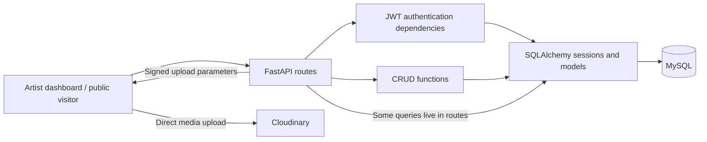

<div align="center">

# ArtLoom360

### The backend behind an artist's digital gallery.

Artist portfolios · Digital exhibitions · Artwork orders · Audience insights


[Overview](#overview) · [Architecture](#architecture) · [Engineering highlights](#engineering-highlights) · [Local setup](#local-setup) · [Roadmap](#roadmap--known-limitations)

</div>

---

## Overview

ArtLoom360 is a backend for an artist platform: artists manage their work, configure portfolio websites, curate digital exhibitions, and receive artwork orders. Public-facing routes serve gallery content and collect audience interactions.

I designed and built this project independently. I am now revisiting the original implementation to improve its reliability, access control, testing, and developer experience. This repository documents both the existing product foundation and the engineering work ahead.

**Current stage:** an existing implementation under active improvement, with known workflow defects and setup gaps. Production readiness and end-to-end behavior have not yet been established.

## Product scope

| Area | Existing implementation |
| --- | --- |
| Artist accounts | Registration, password hashing, JWT login, and current-user retrieval |
| Artwork management | Artwork metadata, pricing, dimensions, status, and artist dashboard queries |
| Digital exhibitions | Exhibition configuration, artist management routes, and public exhibition retrieval |
| Portfolio websites | Website configuration, publishing routes, and public content resolution |
| Artwork orders | Public order submission and artist-facing order retrieval and updates |
| Audience insights | View, like, watch-time, and review records, plus dashboard aggregation |
| Media uploads | Authenticated upload signatures for direct client uploads to Cloudinary |

These describe the code's scope; affected workflows and planned fixes are listed in the [roadmap](#roadmap--known-limitations). Order handling currently records orders; payment processing is future work.

## Architecture

The application is a single FastAPI service backed by MySQL. SQLAlchemy handles persistence, Pydantic defines API contracts, and Alembic tracks schema changes.



Authentication dependencies protect selected artist routes; public routes support visitor workflows. Authorization consistency is an active improvement priority.

Business logic currently spans route handlers and CRUD functions. A future refactor will clarify those boundaries as core workflows gain regression coverage.

```text
app/
├── api/          HTTP routes and request dependencies
├── core/         Database engine and session configuration
├── crud/         Persistence operations and business logic
├── models/       SQLAlchemy models and relationships
├── schemas/      Pydantic request and response contracts
├── utils/        Authentication helpers
├── main.py       Application entry point and router registration
└── seed.py       Development data script
migrations/       Alembic environment and schema revisions
.github/workflows/ Azure deployment workflow
```

## Engineering highlights

These are concrete implementation details worth exploring in the code, alongside their current tradeoffs.

| Implementation | Value and current boundary | Code |
| --- | --- | --- |
| JWT authentication and password hashing | JSON signup/login returns an expiring HS256 bearer token; passwords use Argon2 through pwdlib. Authentication protects selected routes, while ownership checks still need a broader review. | [Authentication](app/utils/auth.py), [Password helpers](app/crud/users.py) |
| Direct signed media uploads | Clients upload media directly to Cloudinary, keeping file transfer out of the API process. The backend issues signed parameters. | [Upload signing](app/api/cloudinary.py) |
| Database-backed public order pricing | Public orders read artwork prices from the database and check artist ownership. Monetary precision and publication eligibility still need strengthening. | [Order creation](app/crud/orders.py) |
| Single commit for public order creation | The public order path flushes the parent order, adds its items, and commits them together. This pattern needs integration coverage. | [Order persistence](app/crud/orders.py) |
| Grouped dashboard queries | Artwork analytics use grouped queries to avoid fetching each artwork's metrics separately. Live performance has not been benchmarked. | [Artwork dashboard](app/crud/artworks.py) |
| Versioned database schema | SQLAlchemy models and sessions handle persistence; Alembic revisions record schema evolution, including metadata fields and analytics indexes. A fresh MySQL migration run passed under Python 3.11; Python 3.12 verification remains pending. | [Database configuration](app/core/database.py), [Migration history](migrations/versions/) |

## Local setup

Use Python 3.12, matching the deployment workflow, and a local MySQL instance. Cloudinary credentials are needed to exercise media upload signing.

### 1. Install dependencies

From the repository root:

```bash
python -m venv .venv
```

Activate the environment:

```powershell
# Windows PowerShell
.venv\Scripts\Activate.ps1
```

```bash
# macOS / Linux
source .venv/bin/activate
```

```bash
python -m pip install -r requirements.txt
```

Requirements include `pwdlib[argon2]` for password hashing, `PyJWT` for tokens, and `Faker` for the optional development data script.

### 2. Configure the environment

Copy the template from the repository root, then replace its placeholders with local values. Do not overwrite an existing `.env`; it is ignored by Git.

```powershell
# Windows PowerShell
Copy-Item .env.example .env
```

```bash
# macOS / Linux
cp .env.example .env
```

| Variable | Purpose / default |
| --- | --- |
| `MYSQL_HOST` | Local MySQL host; set explicitly to `localhost` for both the application and migrations. |
| `MYSQL_USER`, `MYSQL_PASSWORD`, `MYSQL_DB` | Required database credentials and database name. The current URL construction requires URL-safe credentials; reserved characters need URL encoding, and percent escapes are a known Alembic configuration limitation. |
| `SECRET_KEY` | Required JWT signing secret; generate a random value below. |
| `ACCESS_TOKEN_EXPIRE_MINUTES` | Integer token lifetime; defaults to `60`. |
| `CORS_ORIGINS` | Comma-separated frontend origins; defaults to `http://localhost:5173,http://127.0.0.1:5173`. Whitespace and empty entries are ignored. An empty list permits no cross-origin browser access. |
| `CLOUDINARY_CLOUD_NAME`, `CLOUDINARY_API_KEY`, `CLOUDINARY_API_SECRET` | Required when exercising upload signing; placeholders suffice for starting the API without media uploads. |

CORS permits credentials only for configured origins. Wildcards are rejected at startup. Set the exact frontend origins (scheme, hostname, and port, without a trailing slash) for your environment. CORS controls browser access; it does not replace endpoint authorization.

Generate a signing secret with:

```bash
python -c "import secrets; print(secrets.token_hex(32))"
```

### 3. Prepare the database and start the API

Using a local MySQL administrator session, create a dedicated database and user. Replace the example password with the same local password used in `.env`:

```sql
CREATE DATABASE artloom360_local CHARACTER SET utf8mb4;
CREATE USER 'artloom_local'@'localhost' IDENTIFIED BY 'replace_with_local_database_password';
GRANT ALL PRIVILEGES ON artloom360_local.* TO 'artloom_local'@'localhost';
```

Apply the versioned schema and start the API from the repository root:

```bash
python -m alembic upgrade head
python -m uvicorn app.main:app --reload
```

Once running, explore the generated API documentation:

| Interface | Local URL |
| --- | --- |
| Swagger UI | http://127.0.0.1:8000/docs |
| ReDoc | http://127.0.0.1:8000/redoc |
| OpenAPI schema | http://127.0.0.1:8000/openapi.json |

Registration and login accept JSON at `POST /auth/signup` and `POST /auth/login`. Login expects `{"email":"artist@example.com","password":"your_password"}`. Use the returned access token as an `Authorization: Bearer <token>` header for protected endpoints such as `GET /auth/me`.

The OpenAPI OAuth token URL points to `/auth/login`, but Swagger's **Authorize** button sends form data and remains incompatible with this JSON login contract. Use an HTTP client with a bearer header for authenticated requests.

The optional `app/seed.py` script clears existing data before populating the database. It is not part of normal setup and should only be considered for a disposable development database.

## Roadmap & known limitations

### Known limitations

- Website creation includes an unauthenticated route; ownership and publication checks are not yet consistent across public content and website configuration.
- Draft defaults, website creation, and public like/review workflows need correctness fixes. Order quantity, publication eligibility, and monetary precision need stronger validation.
- Swagger form login is unsupported; API/schema consistency, pagination, error handling, and transaction boundaries need follow-up work.
- Configuration is spread across modules. Database URL construction and Alembic percent escaping need improvement.
- Automated regression coverage, CI quality gates, and production reliability checks are not yet implemented. Analytics ingestion has no established abuse controls or performance benchmarks.

### Engineering roadmap

```text
Current product → Correctness & security → Automated tests → CI quality gates
                → Production reliability → Performance / scaling → New features
```

**Next engineering milestone:** finish access-control and workflow stabilization, then establish regression coverage for those boundaries.

| Phase | Completed in this iteration | Pending |
| --- | --- | --- |
| 1 — Stabilize | Dependency declarations, environment template, OAuth URL correction, explicit CORS allowlist, and both artwork status filters. See verification status below. | Verify the full Python 3.12 setup; access-control fixes; API/schema cleanup; remaining workflow defects. |
| 2 — Test | — | Unit and integration tests, authorization regression tests, and order transaction tests. |
| 3 — Productionize | — | Docker, CI with tests and lint, health/readiness endpoints, structured logging, and better configuration management. |
| 4 — Engineer | — | Rate limiting, analytics ingestion improvements, performance testing, and background jobs/queues if justified by measured needs. |
| 5 — Product features | — | Notifications, private exhibitions, and payments. |

### Verification status

Local verification on October 1, 2026 used a fresh **Python 3.11.9** virtual environment and a temporary **MySQL 8.0** database:

- Requirements installation and `pip check` passed; application imports, Argon2 password verification, and JWT round trips passed.
- `alembic upgrade head` reached `27803da7616e`; `uvicorn app.main:app --reload` started successfully. Swagger UI, ReDoc, and the OpenAPI token URL were checked.
- JSON signup/login, authenticated `/auth/me`, and rejection of missing/invalid credentials passed.
- CORS defaults, whitespace/empty-entry parsing, empty allowlists, wildcard rejection, and allowed/disallowed preflights with credential headers passed.
- Both corrected queries returned eligible artwork and excluded drafts, archived artwork, and another artist's artwork against MySQL. The website builder response was also checked over HTTP.

These were one-off smoke checks, not a committed automated test suite or proof of production readiness. Python 3.12 was not installed on the verification machine, so the recommended/deployment runtime still needs a fresh-environment verification run. Cloudinary uploads and full product workflows were not exercised. The temporary database and server were removed after verification.

The repository includes an [Azure deployment workflow](.github/workflows/main_artloom360-api.yml). It installs dependencies with Python 3.12 and deploys the application; it currently has no automated test or lint gate. An automated test suite is an upcoming milestone.

As improvements land, this roadmap will be updated to reflect completed work and the evidence used to validate it.
