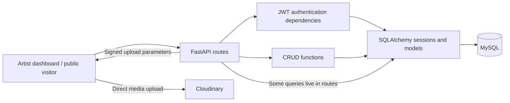

<div align="center">

# ArtLoom360

### The backend behind an artist's digital gallery.

Artist portfolios · Digital exhibitions · Artwork orders · Audience insights


[Overview](#overview) · [Architecture](#architecture) · [Engineering highlights](#engineering-highlights) · [Local setup](#local-setup) · [Roadmap](#roadmap--known-limitations)

</div>

---

## Overview

ArtLoom360 is a backend for an artist platform: artists manage their work, configure portfolio websites, curate digital exhibitions, and receive artwork orders. Public-facing routes serve gallery content and collect audience interactions.

I designed and built this project independently. I am now revisiting the original implementation to improve its reliability, access control, testing, and developer experience. This repository documents both the existing product foundation and the engineering work ahead.

**Current stage:** an existing implementation under active improvement, with known workflow defects and setup gaps. Production readiness and end-to-end behavior have not yet been established.

## Product scope

| Area | Existing implementation |
| --- | --- |
| Artist accounts | Registration, password hashing, JWT login, and current-user retrieval |
| Artwork management | Artwork metadata, pricing, dimensions, status, and artist dashboard queries |
| Digital exhibitions | Exhibition configuration, artist management routes, and public exhibition retrieval |
| Portfolio websites | Website configuration, publishing routes, and public content resolution |
| Artwork orders | Public order submission and artist-facing order retrieval and updates |
| Audience insights | View, like, watch-time, and review records, plus dashboard aggregation |
| Media uploads | Authenticated upload signatures for direct client uploads to Cloudinary |

These describe the code's scope; affected workflows and planned fixes are listed in the [roadmap](#roadmap--known-limitations). Order handling currently records orders; payment processing is future work.

## Architecture

The application is a single FastAPI service backed by MySQL. SQLAlchemy handles persistence, Pydantic defines API contracts, and Alembic tracks schema changes.



Authentication dependencies protect selected artist routes; public routes support visitor workflows. Authorization consistency is an active improvement priority.

Business logic currently spans route handlers and CRUD functions. A future refactor will clarify those boundaries as core workflows gain regression coverage.

```text
app/
├── api/          HTTP routes and request dependencies
├── core/         Database engine and session configuration
├── crud/         Persistence operations and business logic
├── models/       SQLAlchemy models and relationships
├── schemas/      Pydantic request and response contracts
├── utils/        Authentication helpers
├── main.py       Application entry point and router registration
└── seed.py       Development data script
migrations/       Alembic environment and schema revisions
.github/workflows/ Azure deployment workflow
```

## Engineering highlights

These are concrete implementation details worth exploring in the code, alongside their current tradeoffs.

| Implementation | Value and current boundary | Code |
| --- | --- | --- |
| Direct signed media uploads | Clients upload media directly to Cloudinary, keeping file transfer out of the API process. The backend issues signed parameters. | [Upload signing](app/api/cloudinary.py) |
| Database-backed public order pricing | Public orders read artwork prices from the database and check artist ownership. Monetary precision and publication eligibility still need strengthening. | [Order creation](app/crud/orders.py) |
| Single commit for public order creation | The public order path flushes the parent order, adds its items, and commits them together. This pattern needs integration coverage. | [Order persistence](app/crud/orders.py) |
| Grouped dashboard queries | Artwork analytics use grouped queries to avoid fetching each artwork's metrics separately. Live performance has not been benchmarked. | [Artwork dashboard](app/crud/artworks.py) |
| Versioned database schema | Alembic revisions record schema evolution, including metadata fields and analytics indexes. Fresh-database migration verification remains planned. | [Migration history](migrations/versions/) |

## Local setup

Use Python 3.12, matching the deployment workflow, and a local MySQL instance. Cloudinary credentials are needed to exercise media upload signing.

### 1. Install dependencies

From the repository root:

```bash
python -m venv .venv
```

Activate the environment:

```powershell
# Windows PowerShell
.venv\Scripts\Activate.ps1
```

```bash
# macOS / Linux
source .venv/bin/activate
```

```bash
python -m pip install -r requirements.txt
python -m pip install "pwdlib[argon2]" PyJWT
```

**Temporary dependency workaround:** the application imports `pwdlib` and `PyJWT`, but they are currently missing from `requirements.txt`. The second command supplies them and the Argon2 password-hashing backend. Consolidating and pinning these dependencies is planned. The optional seed script also imports `Faker`, which is not currently declared.

### 2. Configure the environment

Create a `.env` file in the repository root with your local values. This file is ignored by Git.

```dotenv
MYSQL_HOST=localhost
MYSQL_USER=artloom_local
MYSQL_PASSWORD=replace_with_local_database_password
MYSQL_DB=artloom360_local

SECRET_KEY=replace_with_a_random_secret
ACCESS_TOKEN_EXPIRE_MINUTES=60

CLOUDINARY_CLOUD_NAME=your_cloud_name
CLOUDINARY_API_KEY=your_api_key
CLOUDINARY_API_SECRET=your_api_secret
```

Generate a signing secret with:

```bash
python -c "import secrets; print(secrets.token_hex(32))"
```

### 3. Prepare the database and start the API

Create the empty `artloom360_local` database in MySQL and give your configured local user access to it. Then run:

```bash
python -m alembic upgrade head
python -m uvicorn app.main:app --reload
```

Once running, explore the generated API documentation:

| Interface | Local URL |
| --- | --- |
| Swagger UI | http://127.0.0.1:8000/docs |
| ReDoc | http://127.0.0.1:8000/redoc |
| OpenAPI schema | http://127.0.0.1:8000/openapi.json |

Registration and login are exposed at `POST /auth/signup` and `POST /auth/login`. Use the returned access token as an `Authorization: Bearer <token>` header for protected endpoints. The Swagger OAuth token URL currently points to `/users/login`; correcting that mismatch is planned.

These instructions reflect the current configuration and source code. A clean installation and full migration run against a fresh MySQL database have not yet been verified.

## Roadmap & known limitations

The immediate focus is making existing workflows correct, reproducible, and testable. The items below are planned work; they are not completion claims or delivery commitments.

| Priority | Area | Next improvement |
| --- | --- | --- |
| Next | Reproducible setup | Declare missing dependencies, add an environment template, and verify installation and migrations against a fresh database. |
| Next | Access control | Apply consistent ownership and publication checks when resolving public content and configuring websites. |
| Next | Workflow correctness | Align draft defaults, repair website creation and public like/review failures, and correct artwork filtering. |
| Next | Authentication contract | Align the documented OAuth token URL with the registered login route. |
| Follow-up | Regression coverage | Test authorization boundaries, draft visibility, public interactions, and order creation against a database. |
| Follow-up | Order validation | Strengthen quantity and eligibility checks and preserve decimal precision throughout price calculations. |
| Follow-up | API consistency | Improve validation, error responses, pagination, and transaction boundaries. |
| Follow-up | Automated checks | Add tests and code-quality checks to CI before deployment. |

### Product ideas under consideration

- Notification delivery for artist activity and orders.
- Private exhibitions and controlled gallery access.
- Gallery membership workflows.
- Payment integration for artwork purchases.

### Verification status

The repository includes an [Azure deployment workflow](.github/workflows/main_artloom360-api.yml). It installs dependencies and deploys the application; it currently has no automated test or lint gate. An automated test suite and verified clean setup are upcoming milestones.

As improvements land, this roadmap will be updated to reflect completed work and the evidence used to validate it.
